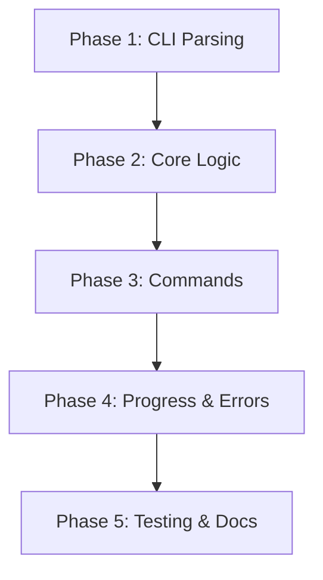

# Headless Mode Implementation Plans

This directory contains comprehensive implementation plans for adding headless mode to `rust-hf-downloader`.

## 📋 Document Structure

### Main Plan
- **[add-headless.md](./add-headless.md)** - Overview and master checklist for the entire feature

### Phase-by-Phase Implementation Plans
Each phase includes detailed tasks, code examples, and verification steps:

1. **[Phase 1: CLI Parsing](./implementation/add-headless-phase1.md)** (2 hours)
   - Add `clap` dependency
   - Define CLI argument structure
   - Set up command parsing

2. **[Phase 2: Core Logic Extraction](./implementation/add-headless-phase2.md)** (2 hours)
   - Create `headless.rs` module
   - Implement reusable functions
   - Set up progress reporting

3. **[Phase 3: Headless Commands](./implementation/add-headless-phase3.md)** (4 hours)
   - Implement search command
   - Implement download command
   - Implement list command
   - Implement resume command

4. **[Phase 4: Progress & Error Handling](./implementation/add-headless-phase4.md)** (2 hours)
   - Enhance progress reporting
   - Add exit codes
   - Comprehensive error handling
   - Signal handling (Ctrl+C)

5. **[Phase 5: Testing & Documentation](./implementation/add-headless-phase5.md)** (1 hour)
   - Add `--dry-run` flag
   - Create test suite
   - Update README.md
   - Add CI/CD examples

## 🎯 Total Estimated Effort
- **Implementation Time**: ~11 hours
- **Phases**: 5
- **Total Tasks**: 29
- **New Files**: 2 (`src/cli.rs`, `src/headless.rs`)
- **Modified Files**: 1 (`src/main.rs`)

## 📊 Progress Tracking

### Overall Status
- [x] Phase 1: CLI Parsing (5/5 tasks) ✅
- [ ] Phase 2: Core Logic Extraction (0/6 tasks)
- [ ] Phase 3: Headless Commands (0/6 tasks)
- [ ] Phase 4: Progress & Error Handling (0/6 tasks)
- [ ] Phase 5: Testing & Documentation (0/6 tasks)

### Current Status
**Phase**: Phase 2 - Extract Core Logic from UI
**Tasks Completed**: 5/29
**Progress**: 17%

## 🚀 Quick Start

1. **Review the main plan**:
   ```bash
   cat plans/add-headless.md
   ```

2. **Start with Phase 1**:
   ```bash
   cat plans/implementation/add-headless-phase1.md
   ```

3. **Follow each phase sequentially** - each builds on the previous

4. **Track progress** - Update checkboxes in each plan as you complete tasks

## 📖 Implementation Order



## 🔍 Key Design Decisions

### Why `clap` for CLI?
- Mature, well-documented library
- Derive macros for clean syntax
- Built-in help generation
- Widely used in Rust ecosystem

### Why Separate `headless.rs` Module?
- **Separation of Concerns**: Keep UI code isolated
- **Reusability**: Share 95% of logic between TUI and headless modes
- **Maintainability**: Headless-specific code (console output) separate from TUI

### Why JSON Output?
- Enables scripting and automation
- Easy parsing by other tools (jq, Python, etc.)
- Optional (default: human-readable)

## 📦 Deliverables

### New Files
- `src/cli.rs` - CLI argument definitions
- `src/headless.rs` - Headless mode logic
- `tests/headless_tests.rs` - Integration tests
- `examples/headless/*.sh` - Usage examples

### Modified Files
- `Cargo.toml` - Add `clap` dependency
- `src/main.rs` - Add CLI parsing and headless detection
- `README.md` - Document headless mode

### Documentation
- CLI reference for all commands
- Exit codes documentation
- CI/CD examples (GitHub Actions, Docker)
- Usage examples for common workflows

## 🎓 Example Usage After Implementation

```bash
# Search for models
rust-hf-downloader --headless search "llama"

# Download specific quantization
rust-hf-downloader --headless download \
  "TheBloke/llama-2-7b-GGUF" \
  --quantization "Q4_K_M" \
  --output "/models"

# Download all files
rust-hf-downloader --headless download \
  "meta-llama/Llama-3.1-8B" \
  --all \
  --output "/models"

# List available files
rust-hf-downloader --headless list "model-id"

# Resume incomplete downloads
rust-hf-downloader --headless resume

# JSON output for scripting
rust-hf-downloader --headless --json search "gpt" | \
  jq '.results[] | select(.downloads > 10000) | .id'
```

## ✅ Success Criteria

### Must Have
- ✅ All four commands implemented (search, download, list, resume)
- ✅ Table and JSON output working
- ✅ Progress tracking functional
- ✅ Comprehensive error handling
- ✅ Proper exit codes (0=success, 1=error, 2=auth, 3=invalid args)
- ✅ No breaking changes to TUI mode
- ✅ Full documentation with examples

### Nice to Have
- Shell completion scripts (bash/zsh)
- Man page generation
- Colored output for errors
- Progress bar animation
- Verbose mode with detailed logging

## 🧪 Testing Strategy

1. **Unit Tests**: Test individual functions in isolation
2. **Integration Tests**: Test full commands with real models
3. **Manual Testing**: Verify TUI mode still works
4. **Error Scenarios**: Test network errors, auth failures, etc.
5. **Performance**: Ensure no significant overhead

## 📚 Additional Resources

- [clap Documentation](https://docs.rs/clap/)
- [Rust CLI Book](https://rust-cli.github.io/book/index.html)
- [HuggingFace API Docs](https://huggingface.co/docs/api/index)

## 🤝 Contributing

When implementing:
1. Follow the plans in order
2. Update checkboxes as you complete tasks
3. Test thoroughly before moving to next phase
4. Document any deviations from the plan
5. Keep commits small and focused

## 📞 Support

If you have questions:
- Review the detailed phase plans
- Check the main plan for context
- Refer to existing code patterns in `src/`
- Test with small models first

---

**Total Estimated Time**: ~11 hours
**Difficulty**: Intermediate
**Impact**: High - enables CI/CD integration and automation
